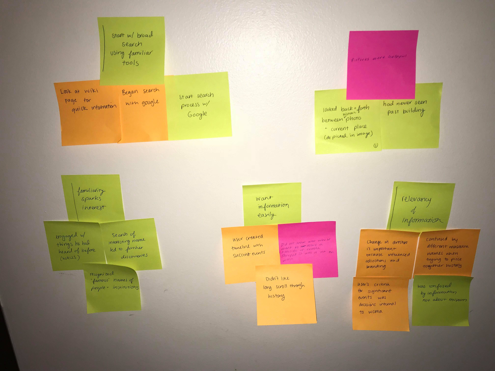
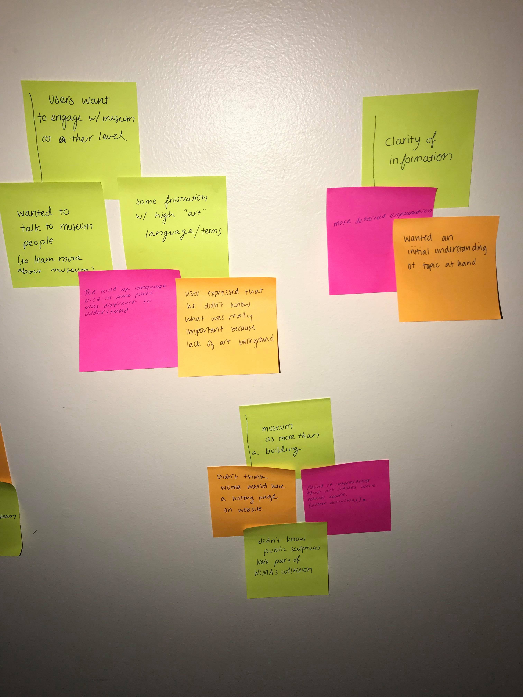
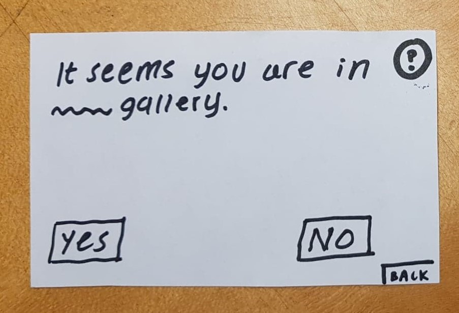
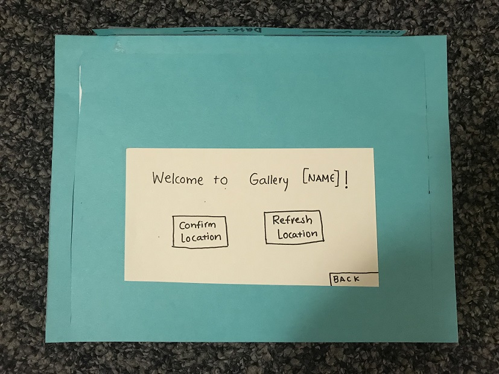
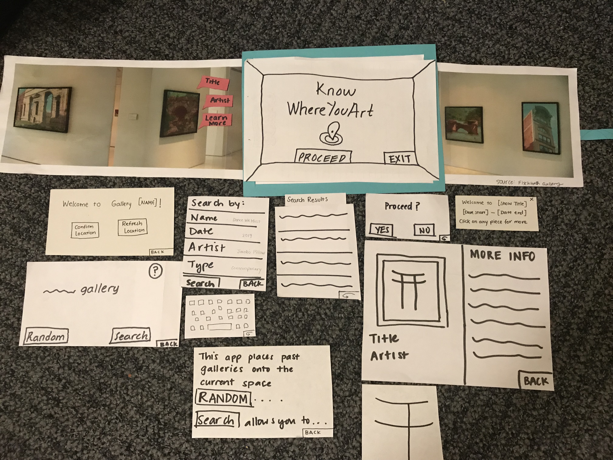
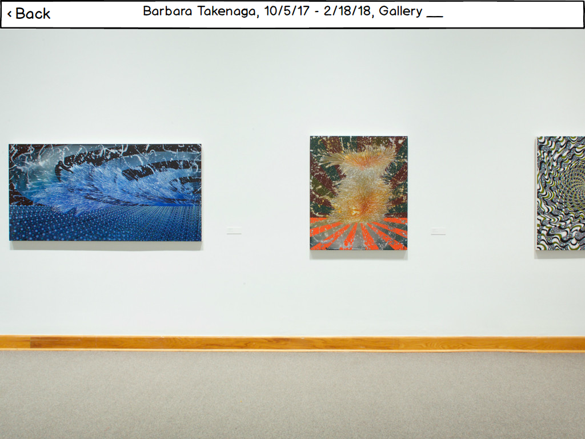
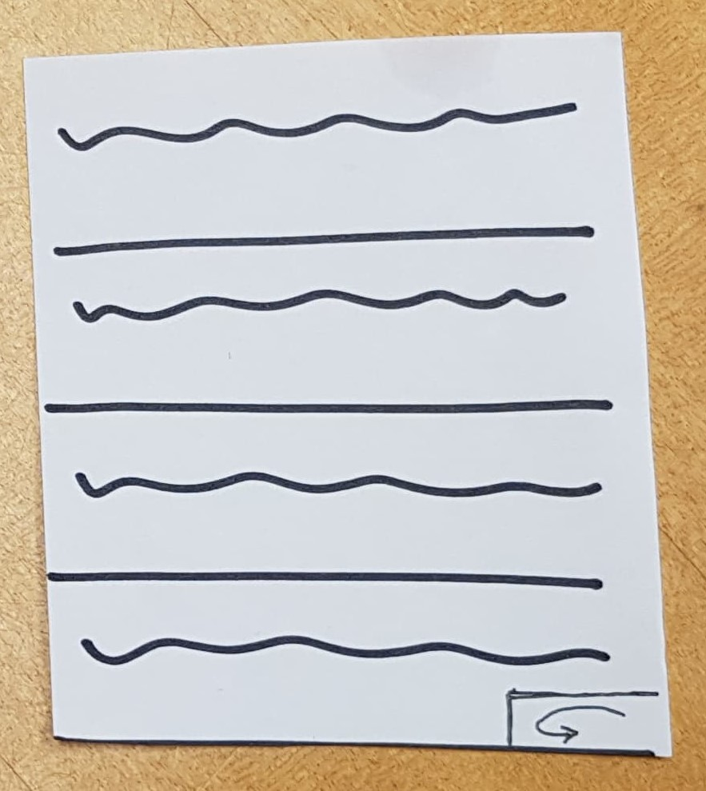
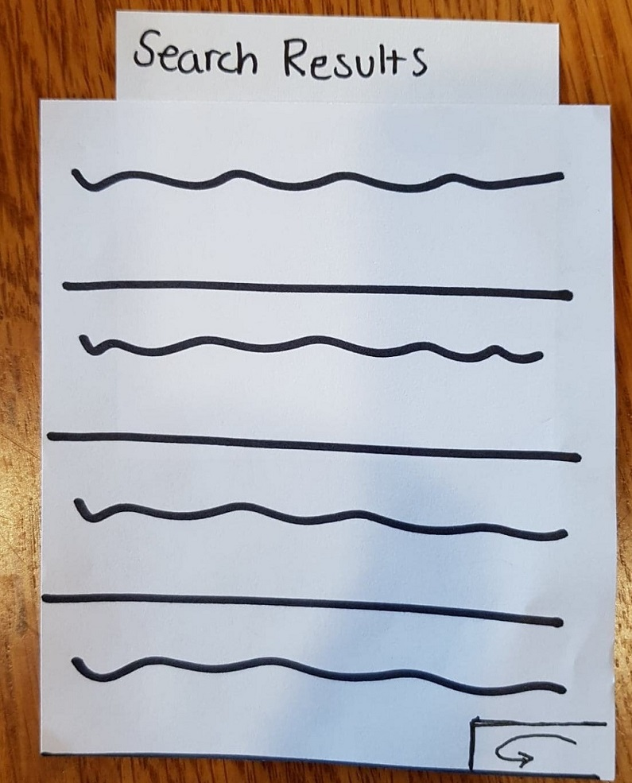

## Introduction

Last year, I visited a design museum in Denmark. One particular part of the museum caught my attention—it was these two huge shelves of chairs that spanned a hallway from floor to ceiling. I was perplexed that a museum would have so many variations of chairs and that they could be so pleasant on the eyes. They also had a poster collection, spanning from propaganda to pop art. In a rush, I didn’t have time to learn more about these collections, and I was left only with my visceral reaction to the museum—everything looked so nice. I thought design was mostly about the aesthetics. After taking this course and working on our design project, [Where You Art]( https://omondieric.github.io/whereYouArt/), an augmented reality app that allows users to view past galleries in current museum galleries, I learned that aesthetics is only a small part of design. Instead, good design is centered on the users, all of whom can be very differnt. 

Here are 5 core principles to good design:

-	Understand the user before designing
-	Good design requires many iterations 
-	Design is about finding a balance in simplicity
-	The user is not like you
-	Understand the impact of your work

### 1.	Understand the user before you design
In our design process for [Where You Art](https://omondieric.github.io/whereYouArt/), way before we even wrote our project proposals, we  began our research process with a Fly on the Wall observation at WCMA. At the core of human-centered design is the *user*. This sounds obvious, but throughout the design process, I’ve learned that it’s difficult to get this right in practice. 

**Gather data about the user first.** It is important not to jump into the design phase before gathering data about the user and fully understanding the problem. This semester, we learned about various data collection methods—[interviews]( https://www.google.com/url?q=https%3A%2F%2Fglow.williams.edu%2Ffiles%2F133121251%2Fdownload%3Fdownload_frd%3D1&sa=D&sntz=1&usg=AFQjCNEokohtt9nOtzZh1R9zHhu1sOa-lQ), [focus groups]( http://www.google.com/url?q=http%3A%2F%2Fwww.nngroup.com%2Farticles%2Ffocus-groups%2F&sa=D&sntz=1&usg=AFQjCNG-zPH94GTXFph-sCSBpSC_6QGZXQ), [contextual inquiries]( https://www.google.com/url?q=https%3A%2F%2Fglow.williams.edu%2Ffiles%2F133121254%2Fdownload%3Fdownload_frd%3D1&sa=D&sntz=1&usg=AFQjCNHPPgX8DGrhoIHY36u0wKOQ7hIlXg) among others—to learn more about the user. For our project, we conducted [3 contextual inquiries]( https://omondieric.github.io/whereYouArt/contextualReview/) to understand how users learn more about the history of a museum and its space. After that, we evaluated our data with an affinity diagram in which we wrote all the data from each contextual inquiry onto sticky notes and tried to summarize our data into larger themes and motifs i.e. get a big picture of our data. 

{:height="60%" width="60%"}
{:height="60%" width="60%"}

*Our affinity diagram*

When we design, our goal is to design something that users will actually want and use. By conducting these contextual inquiries, we had data to support our design decisions to reflect what users would actually want in a design (It is important to note that we only conducted three contextual inquiries, and this is by no means representative of all users. Moreover, given the circumstances, our users were all Williams students, and this is not representative of the general population of WCMA visitors.)

Sometimes it may even be the case that the user says they want one thing in a product, but in reality, they actually want something else (Nielson, 1997). Thus, not only is it important to collect data, but it is important to vary your data collection methods. We cannot rely solely on data collection methods that use self-report (e.g. focus groups) since users may not know what they truly want.
In addition, understanding your users makes for a stronger, evidence-based design. At the end of the day, we want a design that has demand and will actually be used. Beyond this course, in real-world setting, we’ll be dealing with stakeholders, which means that we have to convince them that our design will actually be worth investing in using evidence from user research. For example, in our [initial project proposal](https://omondieric.github.io/whereYouArt/proposal/), though we were addressing a common problem, we didn’t provide evidence to support the motivation for our project, which wouldn't be very convincing in a real-life situation.

## 2.	Good design requires many iterations 
**Trials are a part of the process.** Throughout our entire project, I learned that failure is an essential part of the design process, and it’s an opportunity to learn. For example, in coming up with our [contextual inquiry plan]( https://omondieric.github.io/whereYouArt/contextual/), our original plan was to ask participants to research about WCMA’s history, which extremely vague. In addition, after conducting our contextual inquiries and receiving feedback on them, we learned that we didn’t gather as much data as we should have in part because we weren’t asking enough questions as participants were performing the task. This led to a lack of information when we did our affinity diagram. As seen, we definitely didn’t get it all correct, but it was a learning opportunity for future design projects, and it was by no means diagnostic of our end result. We were still able to design our AR app. 

Iterations also helped us refine our paper prototype. In *Prototyping for Tiny Fingers*, Rettig argues that lo-fi prototyping should be quick and designers should not be tied down to certain ideas as you would in hi-fi prototyping. When we made our paper prototype, we went through many iterations before arriving at our [final prototype](https://omondieric.github.io/whereYouArt/digital-mockup/digital-mockup/). For our initial prototype, we overlooked many things—one of the main issues was the lack of back buttons. After doing a [heuristic evaluation](https://omondieric.github.io/whereYouArt/heuristic_eval/), a cognitive walkthrough, we accordingly made changes to our design e.g. adding signifiers for interacting with art pieces, help options, etc. We also made further changes to our paper prototype after our [usability tests](https://omondieric.github.io/whereYouArt/usability-test/usability-test-review/). We learned that as designers, it's easy to overlook things since we weren’t thinking from the perspective of the user. Moreover, many of our major changes came from feedback during our [usability tests](https://omondieric.github.io/whereYouArt/usability-test/usability-test-review/) such as changing the wording of our welcome screen and adding headers to our search results. It was through all of these steps and iterations that we were able to heavily refine our paper prototype to arrive at our final paper prototype, which was much more user-friendly than our original design. I think it’s safe to say that we most certainly wouldn’t have arrived at this design without all these iterations to help us refine our design.

:---------------------------------------------------:|:-------------------------------------------------------:
 |  
*Our old welcome screen confused users and seemed unsure* | *Updated wording of our welcome screen after feedback from usability test*

{:height="75%" width="75%"}

*Our final paper prototype*

*Digital mockup of viewing a past gallery*

## 3.	Design is about finding a balance in simplicity
Something that came up recurrently was the notion of finding a balance in each step of the design process. In our project, I noticed this when we were designing tasks. Based on our data, we developed [6 tasks](https://omondieric.github.io/whereYouArt/taskReview/), but our design ultimately supported two. From instructor feedback and completing a task review, we learned that some of the tasks we designed were too high-level. For example, one of our initial tasks was “revisit past galleries,” which ultimately ended up being one of our tasks, but in doing our [design review](https://omondieric.github.io/whereYouArt/project-design-review/), we realized that we could break down this task, resulting in our second task, which was “interact with a past gallery.” In developing the tasks we had to find a balance on the level of complexity.

In another instance, we had to find a balance when making our [paper prototype](https://omondieric.github.io/whereYouArt/paper_prototype/paper-prototype/). Before creating a paper prototype, I’d read about keeping paper prototypes simple and text could be replaced with fake text. I’d misinterpret the extent of this simplicity and so, in our initial paper prototype, for our search results, I just made a list with scribbles and nothing else. Making the paper prototype this way was a vast oversimplification of paper prototyping. As the designer, I knew what the intended list was supposed to be, and it wasn’t until our first usability test that I learned that having a list of scribbles is really ambiguous for a user who is unfamiliar with the app. In this step of the design process, we again had to find a balance between simplicity and complexity in paper prototyping.

:-------------------------------------------------:|:-------------------------------------------------------:
 |  
*Old search results list was ambiguous to the user* | *New search results list has a header to remove ambiguity*

## 4.	Accessibility – The user is not like you
One of the main ideas that we learned throughout this course is that the user is not like you. There are 750 million people in this world that have a disability, and that’s a lot of people ([Theofanos & Redish, 2006]( http://www.google.com/url?q=http%3A%2F%2Fredish.net%2Fimages%2Fstories%2FPDF%2FInteractionsPaperAuthorsVer.pdf&sa=D&sntz=1&usg=AFQjCNHBvWuVmmw0SmSiFatN9cTQK5UoHA) ). It is important to always design with accessibility in mind. If, as designers, we don’t design with accessibility in mind, then we are excluding a large group of people. After reading Theofanos & Redish and doing a screen reader activity in class, I learned that it’s more difficult to access information this way. However, as designers, we can make a difference, for example, including things like alternative text and image descriptions will make a difference for those who use screen readers. Moreover, we can make use of the [POUR methodology]( https://www.google.com/url?q=https%3A%2F%2Ftheblog.adobe.com%2Fdesign-with-accessibility-in-mind-the-pour-methodology%2F&sa=D&sntz=1&usg=AFQjCNFn3zGndxxVl5CWIA_QRzF9NrRg-A), which is the framework where we create designs that are perceivable, operable, understandable, and robust (Smyk). An application of this is using good color contrasts for those who have vision impairments. Accessibility should be central to all design projects.

## 5.	 Ethics – Understand the impact of your work
As most of us are computer programmers, sometimes it can feel as if we’re so far removed from the end user that we don’t think about how our work might impact the end user. But we have to understand that our work will make an impact on the lives of others and if we are not always creating in the interest of humanity, then we could potentially harm many people. For example, because of software and hardware issues, the Therac-25 caused six documented cases of radiation overdose. There are countless modern examples of big companies mishandling user information or using loopholes for the interest of themselves. Some ethical guidelines to follow are [ACM’s General Ethical Principles]( https://www.google.com/url?q=https%3A%2F%2Fethics.acm.org%2F&sa=D&sntz=1&usg=AFQjCNECGQAnVCFWIlPgCbymnie1P8pIMg) and [HHI’s The Signal Code]( https://drive.google.com/file/d/13zPDIGJGRb6YPp720pGyaYYRkYn87qx3/view?usp=sharing). 

No matter what we do in computer science, whether it’s programming or designing, we must always consider the ethics of what we’re doing. The end users of our products are human beings.

## Conclusion

Good design is an iterative process that is centered around the user. Therefore, it is important to fully understand the problem and users at hand before finding solutions. As designers, it’s easy to overlook small things, which make usability tests a critical part of the design process. Much of the design process involves finding a balance in simplicity—not too simple, but not too complicated either. There are also many different users, some of whom have disabilities and so we should design with accessibility in mind. We should always be thinking about the impact of our designs on our end users. Now reflecting back on my visit to the Danish Museum of Design, good design is the chairs supporting the needs of their users. 
